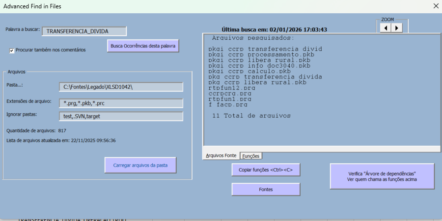
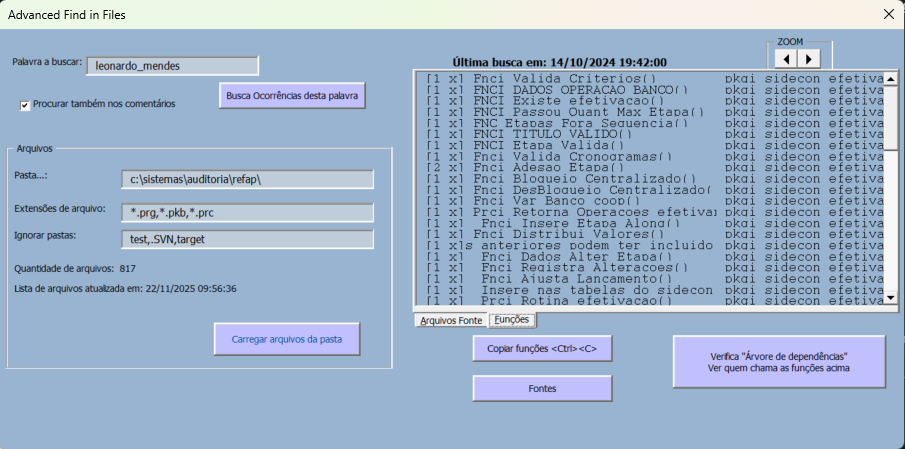
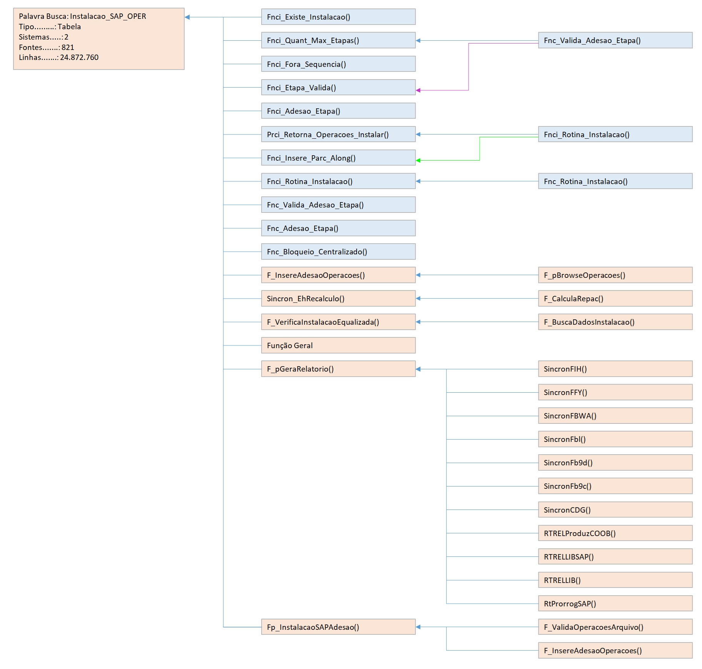
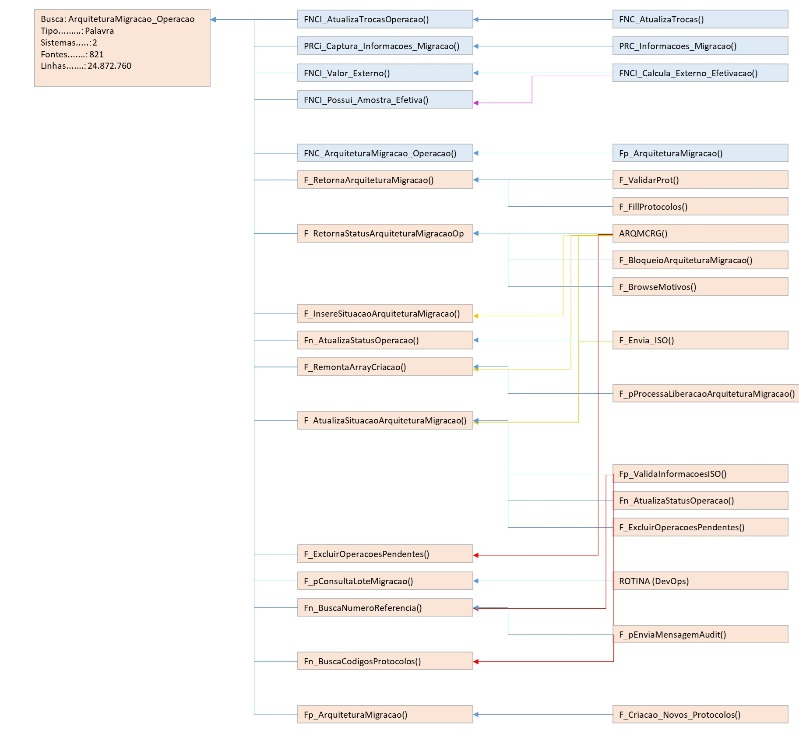
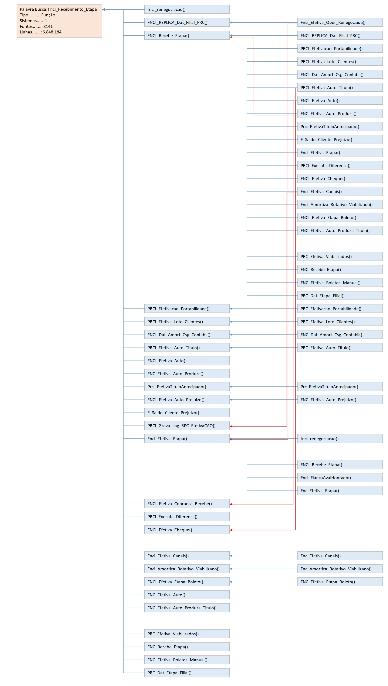
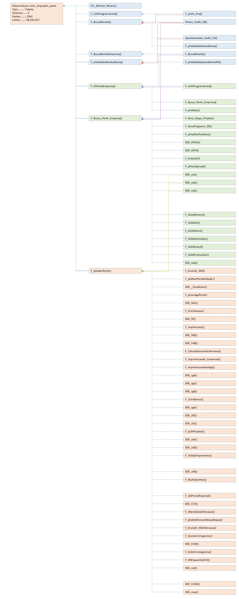

# Mapeador de Fluxos de códigos em programação estruturada

* desenvolvido em VBA
* análise de textos 
* leitura de arquivos 
* construção matematica de imagens

Objetivo e funcionalidade:

- Busca nome de procedures e functions, nomes de tabelas ou palavras no geral 
- Realiza busca em dois níveis
- Agrupa funções e suas recorrências
- Elabora e exibe diagrama de como estas funções estão relacionadas

- Ótimo Para sistemas grandes ou antigos, com muitas funções
- Usado para estudos de impacto e refatoração.

### Pode ser operado diretamente no Excel, ou através de uma tela simples 
#### Verificação de primeiro nível

## Exemplos de Resultado da árvore de dependências 
#### Verificação de segundo nível

